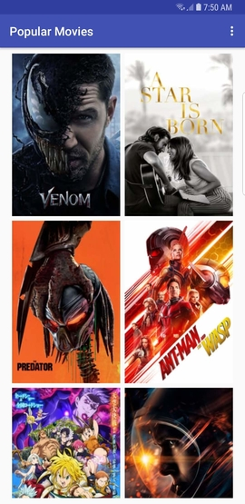
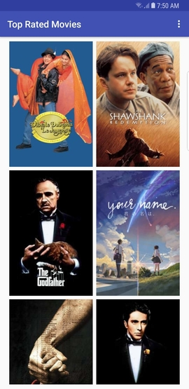
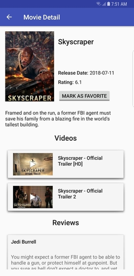
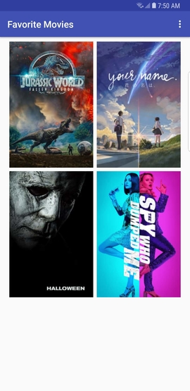
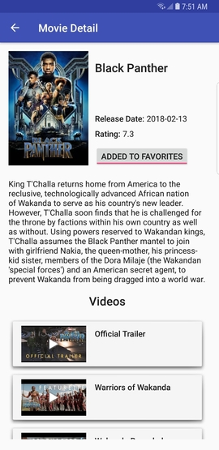

# Popular Movies

App to discover “Popular” and “Top Rated” movies from TMDB API.
You can flip through movie posters, check movie details, watch movie
trailers, read other people's reviews and create a list of your
favorite movies.

- JSON parsing from TMDB API to a model object using Retrofit.
- Designed activity layout using constraint layout.
- Implemented RecyclerView with Grid Layout that draws UI perfectly on phones and tablets.
- Implemented newly released Android Architecture Components; Room, LiveData and
ViewModel.
- Utilized ButterKnife for view binding and Picasso for image loading.

